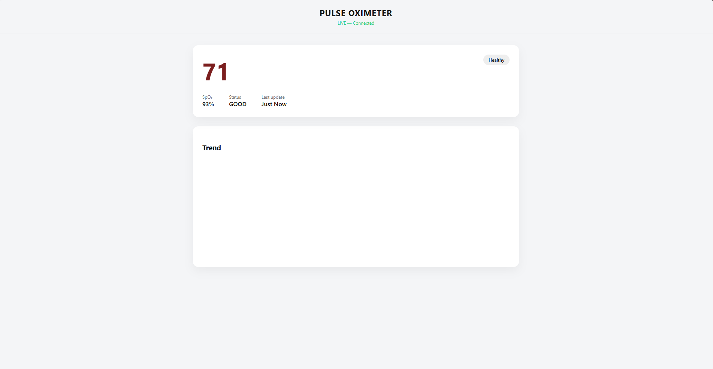

<h1 align="center">❤️ VitalSync</h1>

<b>IoT-Based Real-Time Patient Monitoring System</b> 
Heart Rate • SpO₂ • Embedded Web Dashboard

  
  
  

---

## 🏥 Overview
**VitalSync** is an IoT-based patient monitoring system designed to continuously track **heart rate (BPM)** and **blood oxygen saturation (SpO₂)** in real time.

Built on an ESP32 microcontroller with a pulse oximeter sensor, VitalSync serves live vitals through an **embedded web server**, allowing low-latency monitoring without relying on external cloud services. The system is ideal for **remote healthcare prototypes, hospital monitoring, and wearable health research**.

---

## 🎯 Problem Statement
Traditional patient monitoring systems are often:
- ❌ Expensive  
- ❌ Infrastructure-heavy  
- ❌ Not suitable for rapid prototyping  

VitalSync offers a **low-cost, real-time, and portable solution** for continuous vital monitoring using embedded systems and web technologies.

---

## ✨ Key Features
- 💓 Real-time heart rate (BPM) monitoring  
- 🩸 Blood oxygen saturation (SpO₂) measurement  
- 🌐 Embedded web server (no cloud dependency)  
- ⏱️ 1-second refresh rate  
- 📈 Live BPM trend visualization  
- 🔒 Local network, privacy-focused design  

---

## 🧠 System Architecture
MAX30100 Pulse Oximeter  
↓  
ESP32  
↓  
Embedded HTTP Server  
↓  
Web-Based Dashboard

---

## 🔧 Hardware Components
- ESP32 (WiFi-enabled microcontroller)
- MAX30100 Pulse Oximeter Sensor
- I²C Communication Interface

---

## 🌐 Web Dashboard Features
- 🔢 Live BPM display
- 🩸 Live SpO₂ percentage
- 📊 Real-time BPM graph
- 🕒 Automatic periodic updates
- 💻 Minimal and responsive UI

---

## 🛠️ Tech Stack

### Hardware
- ESP32
- MAX30100 Pulse Oximeter

### Software
- HTML, CSS, JavaScript
- Embedded HTTP Server
- JSON-based REST endpoint

---

## 📂 Repository Structure
VitalSync/  
├── Firmware/ # ESP32 source code  
├── Dashboard/ # Web dashboard files  
├── Screenshots/ # UI & system images  
└── README.md

---

## 📸 Screenshots

---

## 🏥 Applications
- Remote patient monitoring
- Healthcare IoT prototypes
- Wearable health systems
- Smart medical devices

---

## 🚀 Future Enhancements
- Cloud-based data logging
- Mobile app dashboard
- Multi-patient monitoring
- Alert system for abnormal vitals
- Secure authentication

---

## 👤 Author
**Shlok**  

> Built with a focus on reliability, low latency, and real-world healthcare applications.
